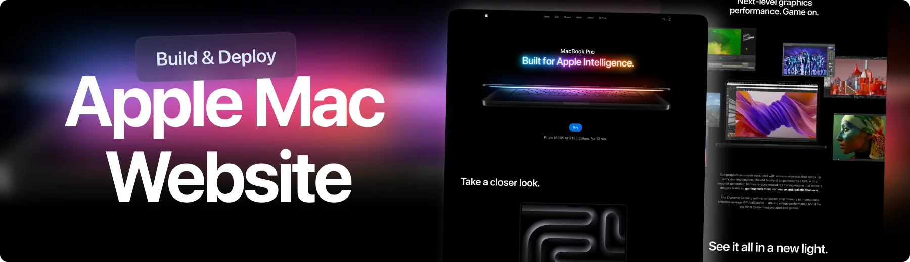

<!-- Hero Image -->
<p align="center">
  
</p>

<h1 align="center">💻 Immersive 3D Product Showcase</h1>

<p align="center">
  A modern, Apple-inspired web experience with smooth scroll animations, 3D product visuals, and rich interactions using <strong>React</strong>, <strong>Three.js</strong>, <strong>GSAP</strong>, and <strong>TailwindCSS</strong>.
</p>

<p align="center">
  🔗 <a href="https://macbook-gsap.vercel.app/" target="_blank"><strong>Live Demo</strong></a>
</p>

---

## 🚀 Overview

This is a fully responsive, scroll-driven 3D product showcase website inspired by Apple's product pages. It features 3D models animated on scroll, immersive pinned sections, and cinematic transitions—built for developers and designers who want to push the boundaries of interactive web experiences.

---

## 🛠 Tech Stack

<p align="left">
  <a href="https://reactjs.org/" target="_blank">
    
  </a>
  <a href="https://threejs.org/" target="_blank">
    
  </a>
  <a href="https://greensock.com/gsap/" target="_blank">
    
  </a>
  <a href="https://tailwindcss.com/" target="_blank">
    
  </a>
  <a href="https://vitejs.dev/" target="_blank">
    
  </a>
  <a href="https://github.com/pmndrs/react-three-fiber" target="_blank">
    
  </a>
  <a href="https://github.com/pmndrs/drei" target="_blank">
    
  </a>
</p>

---

## ✨ Features

- 🎬 Scroll-driven 3D animations
- 📱 Fully responsive and mobile-optimized
- 📌 Pinned sections using GSAP ScrollTrigger
- 🌫 Seamless transitions and immersive visuals
- ⚡️ Fast performance with Vite + code splitting
- 🧩 Modular, scalable React component structure

---

## 🔍 Preview


*Scroll-based animation and MacBook showcase section*

---


---

## 📦 Getting Started

### 1. Clone the Repository

```bash
git clone https://github.com/yourusername/3d-product-showcase.git
cd 3d-product-showcase

- To install Dependencies
npm install

- To start development server
npm install

- Build for Production
npm run build

---

## 🌐 Live Demo

🚀 **[View the Live Site](https://macbook-gsap.vercel.app/)**  
> Best experienced on desktop with modern browsers

---

## 🙏 Credits

- 🎨 MacBook 3D model from [Sketchfab](https://sketchfab.com)
- 📦 React Three Fiber & Drei by [PMNDRS](https://github.com/pmndrs)
- 🧠 GSAP ScrollTrigger by [GreenSock](https://greensock.com/scrolltrigger/)
- 💡 Inspired by Apple product launch pages
- 👨‍💻 Based on work by [Adrian](https://github.com/adrianhajdin) – thanks for the inspiration and structure!

## 📄 License

This project is licensed under the **MIT License**

## 🤝 Let's Connect

If you liked this project, feel free to connect or collaborate:

- 🌐 Portfolio: [https://gideonabe.netlify.app/](#)
- 💼 LinkedIn: [linkedin.com/in/gideonabe](#)
- 🐦 Twitter/X: [@gideon_abe](#)

